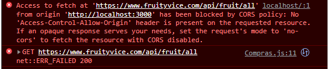
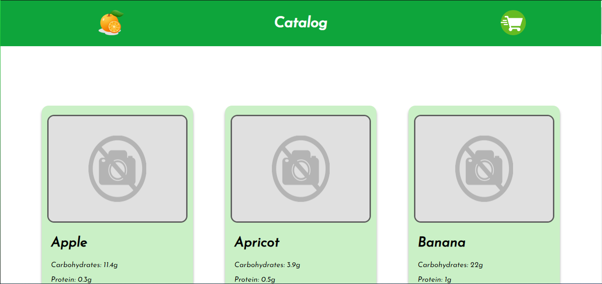
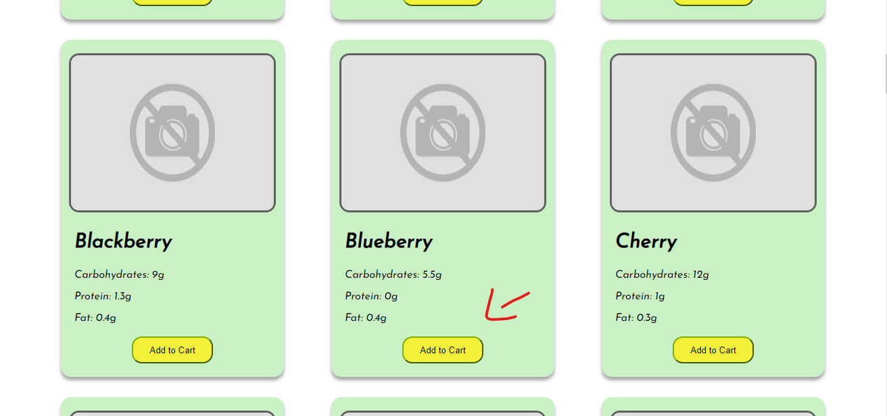
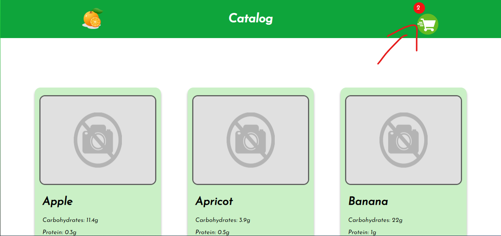
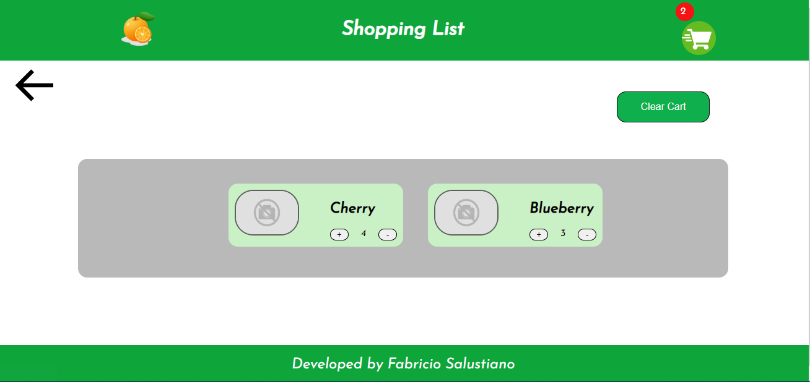
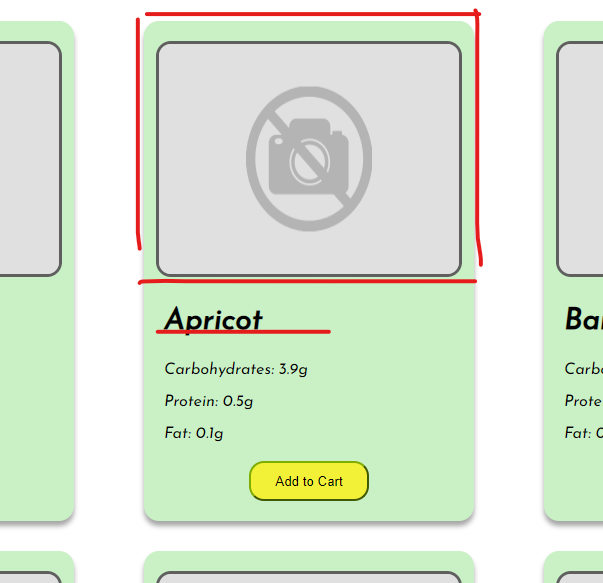
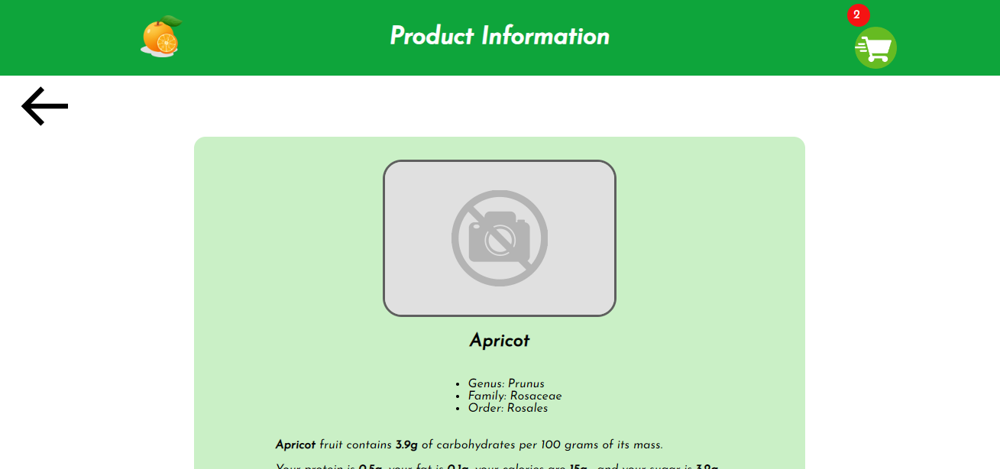
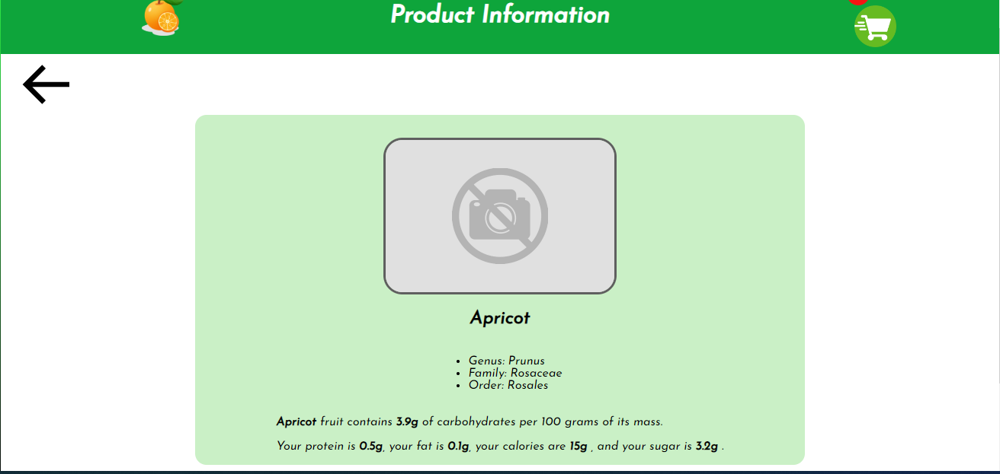

# Hortifruit - Flexco

Este projeto foi feito durante um processo seletivo para vaga de estágio em front-end.

 

Como desafio tive que criar um projeto que continha uma tela de catálogo, listagem dos produtos dentro do meu carrinho e uma tela com informações do produto de forma individual. Também era necessário fazer uso de uma API definida por ele, para inserir todas as informações dos produtos que seriam necessárias.

API Fruityvice documentação: <https://www.fruityvice.com/doc/index.html>

 

O maior desafio do projeto foi conseguir solucionar o erro de Cors que ocorria quando realizava as requisições diretamente da minha aplicação.

 

 

Com muita pesquisa vi que não seria possível realizar alguma ação por parte do front-end pois o erro ocorre quando sua URL não é a mesma que a do provedor dos dados, no caso a API externa, ou quando o provedor da API não habilitou para que todas as URLs acessassem seus dados. Poderíamos neste caso contatar os provedores da API e requisitar com que colocassem minha URL da aplicação em sua lista de liberados, o que não era possível pois não daria tempo de entregar o projeto na data marcada, ou eu poderia intermediar as requisições através de um servidor criado por mim. Acontece que quando as requisições são feitas de servidor para servidor, não há a verificação de URL pelo Cors. Neste caso decidi por criar um servidor, realizar as requisições a ele e ele que se encarregue de requisitar para API os dados e me enviar de volta.

Então quando rodar esta aplicação, lembre de dar um Start no servidor que está localizado na pasta “intermediateServer”.

 

##  Tela inicial

Nesta tela é possível verificar os produtos disponíveis para compra, adicioná-los no carrinho e ver uma previa de suas informações.

 

 

Adicionando o produto clicando no botão “Add to Cart” podemos verificar que o ícone do carrinho se altera indicando que o item foi adicionado.

 

##  Tela do Carrinho

Clicando no próprio ícone do carrinho, temos o redirecionamento para a tela de listagem de itens onde mostrará todos ou nenhum item, em resumo o que estiver dentro de seu carrinho.

Nesta tela será possível você realizar a alteração de quantidades e a exclusão individual dos itens ou total ao clicar no botão “Clear Cart".

 

 

##  Tela de informações do produto

 

Retornando a tela incial, temos a opção de clicar nas imagens dos produtos ou em seu nome que nos redirecionará para a tela que irá conter todas suas informações.

 

 

